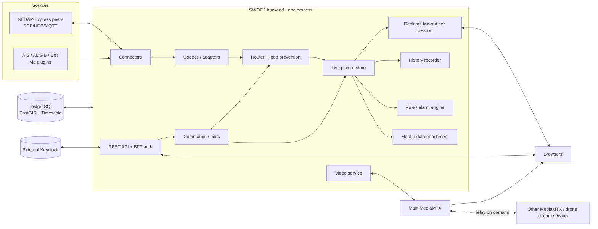

# SWOC2 — Architecture

Section numbers are referenced from CLAUDE.md. Keep them stable and append new sections at the end.

## 1. Overview

SWOC2 is a **modular monolith** (one deployable backend) plus an SPA. Extensibility comes from
well-defined plugin SDKs, not from a microservice landscape. This keeps it simple to run in an
LXC or a single container and offline. Plugin isolation is still guaranteed (§8).



## 2. Deployment topology

- **swoc2 container / JAR:** Spring Boot serves the API, the realtime endpoints **and the built SPA
  from one port**. A single origin means no CORS, simple reverse proxying and easier passage
  through corporate proxies.
- **PostgreSQL** with the PostGIS and TimescaleDB extensions.
- **Keycloak** (decision D-014). SWOC2 only knows the issuer URL. Three supported setups:
  1. **Hosted (recommended):** a shared Keycloak with **one realm per SWOC2 instance**.
  2. **Offline/air-gapped:** compose profile `bundled-keycloak` (Keycloak in the stack, realm import,
     own database on the same PostgreSQL server, served under `{base}/auth`).
  3. **Dev:** `docker-compose.dev.yml` uses the same realm import with test users.
- **Main MediaMTX:** usually deployed next to SWOC2. Optional in compose.
- **Offline images:** all images must be pullable once and transportable with `docker save` / `docker load`.
- **LXC:** fat JAR + systemd unit + PostgreSQL from distro packages. Documented in `deploy/lxc/`.
- **Reference deployment for service computers (GEN-014, validated in P3; the architecture supports it from P0):**

  ```
  Service computer → corporate proxy (443, TLS inspection?, no WS?) → Internet
     → public reverse proxy (Caddy, publicly trusted cert, e.g. Let's Encrypt)
        ├─ /            → SWOC2
        ├─ /auth        → Keycloak   (same domain via proxy location, decided in Q-008)
        └─ (HLS/WHEP via SWOC2's proxy to the main MediaMTX)
  ```

  Consequences:
  - Publicly trusted certificates mean no certificate errors on locked-down browsers.
  - The realtime fallback (§6) and HLS (§13) are the expected path there, not the exception. WebRTC/UDP
    will usually not get through.
  - SWOC2 is internet-facing, so the hardening in §17 applies.
  - `deploy/compose/` contains a Caddy example for exactly this setup.
  - **Keycloak under a path:** Keycloak must know its public URL including the path. Otherwise it
    generates wrong redirect and resource URLs. With current Keycloak versions, set the hostname as a
    full URL (e.g. `https://swoc2.example/auth`) and enable proxy headers, or alternatively set a
    matching HTTP relative path. On the shared Keycloak, set the **Frontend URL of the SWOC2 realm**
    (realm setting) instead of the server-wide hostname, so other realms and systems are unaffected.
    `SWOC2_OIDC_ISSUER_URI` must equal the public issuer.
- **Kubernetes (P4):** Helm chart. The live picture is in memory, so the backend runs as **a single
  replica**. Horizontal scaling is out of scope (see decision D-009).

## 3. Backend structure

Maven multi-module:

| Module | Content | Depends on |
|---|---|---|
| `swoc2-domain` | Canonical model, units, geodesy (GeographicLib), MGRS (NGA mgrs). No Spring. | — |
| `swoc2-plugin-api` | Public SPI for backend plugins. Semver. Breaking changes need `needs-review`. | domain |
| `swoc2-sedap` | SEDAP-Express codec (wraps `io.github.uniity-team:sedapexpress`), mapping SEDAP ↔ domain, COMMAND schemas, crypto hooks. | domain |
| `swoc2-app` | Spring Boot app. Spring Modulith modules as packages: `auth`, `audit`, `picture`, `connections`, `routing`, `realtime`, `masterdata`, `plans`, `tasking`, `chat`, `alerts`, `history`, `video`, `admin`, `settings`, `plugins`, `diag`. | all above |
| `plugins/*` | Backend plugins (e.g. `swoc2-plugin-ais`). Depend **only** on `swoc2-plugin-api`. | plugin-api |

Module boundaries are verified by Spring Modulith tests and ArchUnit. Inter-module communication
uses application events (Spring Modulith event publication registry for reliability) or explicit
module APIs. Never access another module's internals.

**Concurrency:** use virtual threads for blocking I/O (TCP/UDP connections, MediaMTX calls).
The picture store uses lock-striped or concurrent structures and has a single writer per contact key.

## 4. Data flow

**Inbound:**

1. A connector receives bytes or a frame. It wraps them in an `IngressEnvelope {connectionId,
   receivedAt, transportMeta, raw}`.
2. The codec parses the envelope into a typed message. A failure produces a debug-console entry and
   a metrics increment, and the message is dropped. It never throws upward.
3. The **debug tap** publishes raw and parsed data to subscribed debug sessions (if enabled).
4. **Router:** checks loop prevention (§11.3), applies forwarding rules, and marks messages that
   need an ACK.
5. **Mapper → picture store:** upsert of the contact, OWNUNIT, etc. Master-data enrichment fills
   empty fields. The operator override layer is applied on read (§5.2).
6. Change events go to the realtime fan-out (per session, filtered and throttled), the history
   recorder, the alarm engine and master-data auto-capture.

**Outbound:** user action → REST endpoint (RBAC + validation + audit) → domain command → SEDAP
encoder → router selects the target connection(s) → transport. Outbound messages are also
debug-tapped.

## 5. Canonical data model

### 5.1 Contact (simplified)

```
Contact
  id: UUID                       internal, stable
  key: SourceKey                 (connectionId, sourceSystemId, sourceTrackId) — identity across updates
  sourceType: SEDAP_X | AIS | ADSB | COT | SEDAP_NATIVE | USER | <plugin-defined>
  sourceIndicator: String?       e.g. SEDAP-Express source field (A, R, ...)
  kind: CONTACT | OWNUNIT | USER_CONTACT
  symbol: SymbolCode             {set: "app6d" | "2525c" | "custom:<id>" | <plugin>, code: String}
  identity, dimension            enums following APP-6 semantics
  name, trackNumber, remarks
  position: GeoPosition          lat/lon (deg, WGS84), altitude (m, nullable)
  course (deg true), heading (deg true), speed (m/s)   nullable
  sourceTime: Instant            time stated in the message
  receivedAt: Instant            ingest time
  state: LIVE | STALE
  ids: {mmsi?, icao24?, callsign?, ...}
  media: [MediaRef]              images, stream URLs (from CONTACT/STATUS)
  classification                 security classification of the latest message
  raw: Map<String,Object>        all source fields not mapped above (shown in CAC)
```

### 5.2 Layered attribute resolution

The displayed value of a descriptive field is resolved per field in this order:

1. **Operator override** (stored separately, with who and when, resettable). It wins, so edits
   survive source updates.
2. **Source value**, if present and non-empty.
3. **Master data value** (by MMSI or ICAO).

Kinematics (position, course, speed, time) always come from the source. The override layer is
part of the shared picture and is persisted. This means it survives restarts. It is cleared only
together with a live-picture wipe, or kept if the contact can be re-identified by its key.

### 5.3 Units

The domain uses SI units and UTC only. Formatting and parsing for the UI live in
`frontend/packages/units` and are covered by extensive unit tests (incl. MGRS and DMS parsing of
messy pasted input). The backend has equivalent helpers in `swoc2-domain` for exports.

## 6. Realtime protocol & transports

Specified in detail in `docs/realtime-protocol.md` (written in Phase 0).

- **Envelope:** `{v, seq, type, payload}`. `seq` increases per session.
- **Session state** (server-side, per browser session): viewport (bbox + zoom), active layers and
  filters, mode (`live` | `replay@t`), render capability (WebGL / Canvas).
- **Snapshot + deltas:** on subscribe or after a gap, the server sends a snapshot of the viewport,
  then deltas (upsert/remove/state). If the client detects a `seq` gap, it requests a resync.
- **Server-side throttling:** deltas are batched per session (default 2 Hz, configurable).
  Only contacts in or near the viewport are sent.
- **Aggregation mode:** when the number of contacts in the viewport exceeds a threshold (lower in
  Canvas mode), or the zoom is below a configurable level, the server sends **MGRS cell aggregates**
  `{cellId, countsByIdentity}` instead of contacts. The server maintains these aggregates
  incrementally, because the picture store is indexed by MGRS cell.
- **Transports** (one interface, interchangeable):
  1. WebSocket (primary)
  2. SSE for downstream + HTTPS POST for upstream
  3. HTTPS long-polling (`GET /rt/poll?after=seq`, ~25 s hold) + POST

  The client negotiates automatically: it tries WS, falls back on failure or timeout, and periodically
  retries the better transport. The user can force a transport in the settings. Proxies that buffer
  SSE are detected by a heartbeat timeout.
- **Encoding:** JSON first. A binary encoding can be added behind the same interface later if
  profiling demands it.

## 7. Authentication & authorization

**Backend-for-frontend (BFF).** Spring Security acts as a confidential OIDC client (authorization
code flow + PKCE, server-side) against the external Keycloak. The browser holds only an `HttpOnly`
session cookie.

Reasons (they apply on HTTPS too; HTTP support is a side benefit, not the main driver):
- **Transport independence:** a cookie travels automatically with WS, SSE and long-polling.
  With browser-held tokens, SSE (`EventSource` cannot set headers) and WS would need the token in the
  URL, which leaks into proxy logs, plus token refresh over long-lived connections.
- **Security:** an `HttpOnly` cookie cannot be stolen by XSS. This matters because plugins load
  additional frontend code.
- **Plain HTTP works** (GEN-003). Browser OIDC libraries need Web Crypto, which only exists in
  secure contexts.

Details:
- Cookie: `HttpOnly`, `SameSite=Lax`. The `Secure` flag is configurable (auto: on when the public
  URL is https). CSRF protection applies to state-changing requests.
- `SWOC2_OIDC_ISSUER_URI` is the browser-facing Keycloak URL (it must match the `iss` claim).
  `SWOC2_OIDC_BACKCHANNEL_URI` can be set if the backend reaches Keycloak under a different internal
  address (a typical Docker situation).
- Roles: client roles `viewer`, `operator`, `commander`, `admin` of the SWOC2 Keycloak client,
  mapped to Spring authorities. The hierarchy is admin > commander > operator > viewer.
- **Invites (AUTH-003):** invite tokens are managed by SWOC2 (hashed in the DB: expiry, max uses,
  role, approval required).
  - **New user:** the SWOC2 registration page validates the token → creates the user via the
    Keycloak Admin REST API → assigns the client role → redirects to login. The service account has
    user-management rights **only in the SWOC2 realm** (`manage-users`, `view-users`, `query-users`
    of `realm-management` in that realm), which is harmless for other systems.
  - **Existing Keycloak user without a SWOC2 role:** logs in → sees "Redeem invite" → the role is granted.
  - Fallback mode `existing-users-only` (`SWOC2_REGISTRATION_MODE`): for setups without a
    service account. The admin creates accounts in Keycloak, and invites only grant roles.
- **API clients (P3):** the API additionally accepts bearer tokens (resource-server mode) for
  client-credentials service accounts, with the same RBAC.

## 8. Plugin architecture

### 8.1 Frontend

- **Plugin manifest:** `{id, name, version, sdkVersion, requiredRoles?, contributes: {...}}`.
- **Extension points** (PLG-001): `routes`, `panels`, `mapLayers`, `contextMenu` (with predicates,
  e.g. "contact is OWNUNIT"), `toolbar`, `userSettings`, `adminPages`, `symbolProviders`, `mapTools`,
  `notificationSources`, `coordinateFormats`.
- **SDK surface:** a typed, versioned facade over core services: picture queries/subscriptions,
  hook/select state, map API (add layer, pick coordinate, draw), API client (with auth), notifications,
  theme tokens, unit formatting, scoped plugin settings storage, event bus.
  Plugins never access core stores directly.
- **Isolation:** every contribution is rendered inside an error boundary with a "plugin failed"
  placeholder and a reload button. Context-menu predicates and handlers are wrapped in try/catch.
- **Loading:** P1 uses build-time registration (`frontend/plugins/*` as workspace packages).
  P4 adds runtime loading of ESM bundles served by the backend (`/plugins/{id}/entry.js`) with shared
  dependencies via import maps.

### 8.2 Backend

- **SPI** in `swoc2-plugin-api`: `ConnectionType` (config schema + factory), `MessageAdapter`
  (decode to domain / encode from domain), `EnrichmentProvider`, `RuleType`, `PluginEndpoint`,
  `ScheduledTask`, `PluginLifecycle`.
- Config schemas are JSON Schema. The admin UI renders forms from them, so new connection types need
  no admin UI code.
- **Isolation:** every SPI call goes through an invoker that applies a timeout, an exception barrier,
  metrics and a circuit breaker. A failing plugin is disabled automatically after repeated errors and
  shown in plugin health. Implemented in P0 (ADR 0019): calls run on virtual threads, `N`
  consecutive failures switch the plugin to `FAILED`; plugin endpoints live under
  `/api/plugins/{id}/endpoints/{path}`, health under `GET /api/plugins`, admin switches under
  `POST /api/plugins/{id}/enable|disable`.
- **Loading:** P1 discovers plugins via `ServiceLoader` on the classpath. Runtime loading (e.g. PF4J or
  separate processes) is decided in an ADR in P4.

## 9. Map rendering

- **OpenLayers** with WebGL vector layers for contacts. Canvas is used automatically when WebGL is
  missing (detected at startup and shown on `/diag`).
- **Symbol atlas:** each unique combination of `(symbolSet, code, size, fill/frame, LOD modifiers,
  theme, state stale/live)` is rendered **once** by its SymbolProvider into a dynamic texture atlas
  and cached. Contacts reference atlas entries. Never render one SVG per contact.
- **Labels:** a separate layer with decluttering. Label density is limited by zoom and contact count.
  Labels are hidden in aggregation mode.
- **Hook / select / distance lines / reference points / tools:** separate overlay layers.
- **Input bindings** are centralised and configurable (`primary click` → hook, `middle` or
  `shift+primary` → select, `long-press` → context menu, select-mode toggle for touch).
- **SymbolProvider** interface:
  `{id, supports(code): boolean, render(code, opts): {image, anchor, size}, describe(code): metadata}`.
  milsymbol is the default provider. Custom icon sets are provided via admin upload plus a mapping table.
- **WMS/WMTS:** created from the admin wizard configuration (GetCapabilities parsed in the backend for
  validation and in the frontend for the preview). Non-3857 CRSs use OL reprojection.
  Overlay z-order is fixed above base layers.
- **3D (P4):** the Cesium plugin consumes the same subscription API and layer configuration.

## 10. Storage

| Data | Where | Notes |
|---|---|---|
| Live picture | In memory (concurrent maps + MGRS cell index) | Optional periodic snapshot to DB for restart recovery |
| Operator overrides | Postgres (`picture_override`) | Keyed by SourceKey |
| Users' view state, saved views, settings | Postgres (`user_settings` jsonb) | Versioned schema, validated |
| Invites, audit log | Postgres | Audit is append-only |
| Connections, map layers, MediaMTX servers, instance settings | Postgres | Secrets encrypted with `SWOC2_SECRET_KEY` |
| Master data | Postgres (`md_vessel`, `md_aircraft`, provenance tables) | Field-level provenance for merging |
| Images / media files / offline tiles | File system `SWOC2_DATA_DIR` | Content-addressed (hash); metadata in DB |
| Plans | Postgres/PostGIS | Original import file is kept for re-export |
| Tasks / commands | Postgres | Full lifecycle history |
| History | TimescaleDB hypertable `track_point` | Compression + retention policy. Downsampling per source: write when moved > d m or Δt > t s |

**Exchange formats** (versioned, with a `manifest.json` that contains the instance ID, schema version and time range):
- Recording: `.swoc2rec` (zip of NDJSON chunks + manifest)
- Master data package: `.swoc2md` (zip of NDJSON + images + manifest)

## 11. SEDAP-Express & connections

### 11.1 Codec

SWOC2 has its own tolerant, schema-driven codec (ADR 0017, Spike C): invalid or unknown fields
are kept raw with a warning, never thrown. The reference library is a test-scoped conformance
oracle, not a runtime dependency. Every message type, COMMAND type and GRAPHIC shape is covered by
round-trip tests, and every ICD sample by a decode/re-encode test (`docs/icd/NOTES.md`). COMMAND types are described by **declarative schemas** (parameters, types, units,
required, map-pickable) in `swoc2-sedap`. The tasking wizard UI is generated from these schemas, so
the full palette needs no hand-written forms.

### 11.2 Connections

A connection consists of a type, a config (JSON Schema validated), a direction (in/out/both), aging
overrides and a crypto profile (P4). Lifecycle: `disabled → connecting → up → degraded → down`, with
exponential backoff. Metrics per connection: msgs in/out per second, bytes, errors, last error,
last message time.

### 11.3 Routing & loop prevention

- Every inbound message carries `originConnectionId`. The router **never** emits it back to that connection.
- Messages carrying our own sender ID are dropped on ingress.
- **Dedup cache** keyed by `(senderId, messageType, messageNumber, sourceTime)` with a TTL. Duplicates
  are dropped, which breaks multi-hop loops between gateways.
- Forwarding rules (P3): `{from: [connectionIds], to: [connectionIds], types: [...], filter}`.
- **OWNUNIT routing table:** OWNUNIT key → last ingress connection. Used for COMMAND delivery (CON-007).

### 11.4 Commands & ACKs

The command lifecycle (TSK-007) lives in the `tasking` module. ACK correlation follows the ICD.
A missing ACK after a timeout moves the task to `no-response` and creates **at most one**
notification per command. Fire-and-forget commands go straight to `sent`.

## 12. Configuration (environment variables)

All variables are documented in `.env.example`. Defaults are chosen for local dev.

| Variable | Default | Purpose |
|---|---|---|
| `SWOC2_HTTP_PORT` | `5080` | Port for SPA + API + realtime |
| `SWOC2_BASE_PATH` | `/` | Sub-path when behind a reverse proxy (e.g. `/swoc2`) |
| `SWOC2_PUBLIC_URL` | `http://localhost:5080` | External URL (redirects, cookie Secure auto-detect) |
| `SWOC2_FORWARDED_HEADERS` | `true` | Trust `X-Forwarded-*` / `Forwarded` |
| `SWOC2_COOKIE_SECURE` | `auto` | `auto` / `true` / `false` |
| `SWOC2_DB_URL` / `_USER` / `_PASSWORD` | `jdbc:postgresql://localhost:5082/swoc2` / `swoc2` / — | PostgreSQL + PostGIS + TimescaleDB (ADR 0020); hard dependency, the app waits ~1 min for it at startup |
| `SWOC2_OIDC_ISSUER_URI` | — | Browser-facing Keycloak realm URL |
| `SWOC2_OIDC_BACKCHANNEL_URI` | (= issuer) | Internal Keycloak URL if different |
| `SWOC2_OIDC_CLIENT_ID` / `_CLIENT_SECRET` | — | Confidential client |
| `SWOC2_KC_ADMIN_CLIENT_ID` / `_SECRET` | — | Service account for invite registration (optional) |
| `SWOC2_REGISTRATION_MODE` | `invite` | `invite` / `existing-users-only` / `disabled` |
| `SWOC2_DATA_DIR` | `./data` | Media, offline tiles, imports |
| `SWOC2_SECRET_KEY` | — (required in prod) | Encrypts stored secrets (connection passwords, keys) |
| `SWOC2_LOG_LEVEL` | `INFO` | |
| `SWOC2_PROFILE` | `prod` | `dev` enables the debug console by default, dev Keycloak, etc. |
| `SWOC2_PLUGINS_ENABLED` / `_DISABLED` | (empty) | Plugin ids to force on/off at startup (e.g. `example`) |
| `SWOC2_PLUGINS_CALL_TIMEOUT` | `5s` | Timeout of every call into a backend plugin |
| `SWOC2_PLUGINS_MAX_FAILURES` | `3` | Consecutive failures after which a plugin is disabled automatically |
| `SWOC2_TLS_MODE` | `off` | `off` (plain HTTP or TLS at the proxy) / `provided` / `self-signed` (GEN-013) |
| `SWOC2_TLS_CERT_FILE` / `_KEY_FILE` | — | PEM files for `provided` mode |
| `SWOC2_ADMIN_ALLOWED_CIDRS` | (empty = all) | Optional allowlist for the admin UI and admin API (GEN-015) |
| `SWOC2_SESSION_TIMEOUT` | `PT12H` | Absolute session lifetime (an idle timeout applies as well) |
| `SWOC2_RT_HEARTBEAT` | `10s` | Realtime idle heartbeat on WS/SSE (`docs/realtime-protocol.md` §7) |
| `SWOC2_RT_POLL_HOLD` | `25s` | Maximum hold of a long-poll request |
| `SWOC2_RT_SESSION_TTL` | `60s` | Lifetime of a realtime session without an attached transport |
| `SWOC2_RT_BUFFER_SIZE` | `1000` | Replay buffer per realtime session (envelopes) |
| `SWOC2_RT_MAX_SESSIONS_PER_USER` | `10` | Older realtime sessions of a user are closed beyond this |
| `SWOC2_RT_BATCH_INTERVAL` | `500ms` | Delta batching interval (2 Hz) |

The SPA reads runtime config (base path, feature flags) from `GET {base}/config.json`, served by the
backend. This keeps the build artefact identical for every deployment. Vite builds with a relative base.

## 13. Video

- **MediaMTX client** per configured server (Control API v3): list paths, health.
- **Main MediaMTX = single egress for clients.**
  - Streams from other servers are made available by registering a **pull path on demand** on the
    main server (`source` = remote URL, `sourceOnDemand: true`).
  - Drone/media URLs from STATUS/CONTACT are registered the same way (VID-005). A drone stream is
    pulled once, no matter how many clients watch.
- Clients reach the main MediaMTX **only through SWOC2's reverse proxy** for WHEP signalling and HLS.
  WebRTC media requires the main MediaMTX's ICE/UDP port to be reachable from clients. When it is not
  (restricted mode), the player falls back to HLS over HTTPS automatically.
- Contact ↔ stream links are stored in the `video` module and offered in the CAC and context menu.

## 14. Observability & error handling

- Structured JSON logs with correlation IDs (request, connection, session).
- `/actuator/health` and `/actuator/metrics` (protected). The admin system-health page builds on them.
- Debug console stream (DBG) is separate from logs, bounded by a ring buffer and rate-limited.
- Frontend: a global error boundary, per-panel and per-plugin boundaries, and toasts for recoverable
  errors. Unexpected errors are reported to the backend (`POST /api/client-errors`, rate-limited).

## 15. Testing

- Unit: domain, units/coords, geodesy, codec (all ICD types), router/loop prevention, aging, aggregation.
- Integration: Testcontainers (Postgres+PostGIS+Timescale, Mosquitto), connector round trips over real
  sockets, Spring Modulith module tests.
- Frontend: Vitest for packages and stores, Playwright E2E for critical flows (login, hook/CAC edit,
  chat, command wizard, plan import) from P2.
- Restricted-mode test: a compose profile with a proxy that blocks WebSocket upgrades.
- Performance spike harness (P0): synthetic generator for 100k contacts. External load tools for
  NFR measurements.

## 16. Decision log

Phase 0 converts each entry into an ADR file in `docs/adr/` (D-001 → `0002-...`, because `0001` holds the pinned versions).

| ID | Decision | Rationale |
|---|---|---|
| D-001 | Java/Spring Boot backend | Reference SEDAP-Express library is Java; maintainer expertise; mature OIDC and virtual threads |
| D-002 | Modular monolith with Spring Modulith | Simple ops (LXC, offline), enforced boundaries |
| D-003 | BFF auth with session cookie | Plain-HTTP support, transport independence, no tokens in browser |
| D-004 | Own realtime protocol with WS/SSE/long-poll fallback | Corporate proxy compatibility from day one |
| D-005 | OpenLayers for 2D | Best WMS/WMTS/CRS support; WebGL layers for scale |
| D-006 | Symbol atlas instead of per-contact SVG | 100k contacts performance |
| D-007 | Canonical domain model; SEDAP-Express is an adapter | Multiple source formats, native SEDAP later |
| D-008 | Override layer for operator edits | Edits survive source updates; resettable |
| D-009 | Single backend replica, in-memory picture | Simplicity and latency; horizontal scaling out of scope |
| D-010 | Main MediaMTX as the single video egress, others relayed on demand | Clients only reach SWOC2; drones upload once |
| D-011 | PostgreSQL + PostGIS + TimescaleDB as the only DB | One system for relational, spatial and time series |
| D-012 | MGRS-aligned aggregation grid | Military usability; cell index doubles as spatial index |
| D-013 | HTTPS recommended, HTTP supported with graceful degradation; service computers via public reverse proxy | Trusted certs for locked-down browsers; local/offline use stays simple |
| D-014 | Keycloak: one realm per SWOC2 instance on a shared Keycloak (hosted), bundled Keycloak profile (offline) | Realm isolation solves the issuer/path issue and safe service-account rights; offline instances must be self-contained |

## 17. Security hardening (internet-facing)

Required because of GEN-014 / GEN-015:

- **Headers:** a strict CSP (no inline scripts, `connect-src 'self'`, the plugin origins we serve
  ourselves), HSTS when the public URL is https, `frame-ancestors 'none'`, `Referrer-Policy`,
  `X-Content-Type-Options`.
- **Rate limiting:** login start, registration, invite redemption and the client-error endpoint,
  keyed by client IP. The client IP is taken from forwarded headers **only from trusted proxies**.
  The same rule applies to `SWOC2_ADMIN_ALLOWED_CIDRS`. Otherwise the allowlist could be bypassed with
  a forged `X-Forwarded-For`.
- **Sessions:** idle and absolute timeout, session ID rotation after login, logout also ends the
  Keycloak session.
- **Error responses** never contain stack traces or internal hostnames.
- **Keycloak** handles brute-force protection and MFA via realm policy. SWOC2 documents the
  recommended settings in `deploy/README.md`.
- **Dependencies:** CI runs a dependency vulnerability scan (Maven and pnpm) and an image scan.
